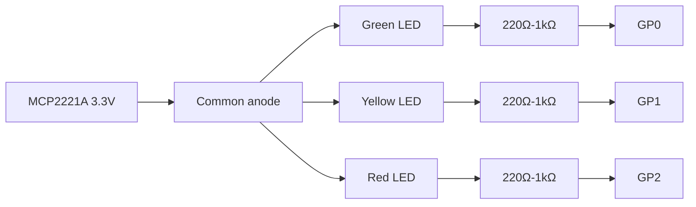

# Vibecoding Signal Light

[中文](README.zh.md) | **English**

> A real traffic light for AI agents.

Vibecoding Signal Light turns a small red/yellow/green traffic signal model into an ambient status display for Codex, Claude Code, and other local AI coding agents. When the agent is working, waiting, blocked, or asking for permission, the light on your desk changes with it.

It is deliberately simple: glance at the lamp, know whether you should keep flowing or look back at your agent.

## Demo


The reference build mounted beside a laptop, showing the steady green idle state.

## Why This Exists

AI coding agents are getting more autonomous, but their state is still trapped inside a terminal or chat window. That creates two awkward modes:

- You keep checking the agent too often and break your own focus.
- You forget it is waiting for permission, a result review, or a failure recovery.

This project gives the agent a physical presence:

- Green means you can relax.
- A flashing green cycle means the agent is busy.
- Yellow means the agent explicitly needs a look.
- Red means stop what you are doing and unblock it.

## Hardware

The current reference build uses:

| Part | Description |
| --- | --- |
| MCP2221A USB GPIO adapter | Drives the traffic light from a Mac/Linux machine over USB |
| 3-light traffic signal model | Red, yellow, and green LEDs or lamp modules |
| Python + EasyMCP2221 | Local GPIO control, no network service required |

Default wiring is active-low:

| Signal | MCP2221A pin | Meaning |
| --- | --- | --- |
| Green | `gp0` | Idle |
| Yellow | `gp1` | Attention |
| Red | `gp2` | Permission, blocked, or failed |
| Active level | GPIO `LOW` | Light on |

### Wiring

The reference build uses a common-anode, active-low LED-style wiring. Each light has its own current-limiting resistor unless your traffic light module already includes one.

```text
MCP2221A 3.3V  ────────────────┬── Green LED anode
                               ├── Yellow LED anode
                               └── Red LED anode

Green LED cathode   ── 220Ω-1kΩ ── GP0
Yellow LED cathode  ── 220Ω-1kΩ ── GP1
Red LED cathode     ── 220Ω-1kΩ ── GP2
```



In this mode, the MCP2221A GPIO pin sinks current:

- GPIO `HIGH`: light off
- GPIO `LOW`: light on

If your signal model is common-cathode or active-high, wire each GPIO through a resistor to the LED anode, connect the cathodes to `GND`, and set:

```bash
export SIGNAL_LIGHT_ACTIVE_LOW=0
```

Important: MCP2221A GPIO pins are for small LED loads only. If your traffic light uses 5V/12V lamps, LED strips, relays, or anything above the GPIO current limit, use a transistor, MOSFET, relay module, or dedicated LED driver between the MCP2221A and the light.

You can override the wiring:

```bash
export SIGNAL_LIGHT_GREEN_PIN=gp0
export SIGNAL_LIGHT_YELLOW_PIN=gp1
export SIGNAL_LIGHT_RED_PIN=gp2
export SIGNAL_LIGHT_ACTIVE_LOW=1
```

Set `SIGNAL_LIGHT_ACTIVE_LOW=0` if your traffic light is wired active-high.

## Lamp Language

The language is intentionally small and persistent. The current light should always describe the current state.

| Light | Agent state | Human action |
| --- | --- | --- |
| Steady green | Idle | Nothing |
| Flashing green | Working (thinking, tools, tests) | Wait |
| Flashing yellow | Explicit attention needed | Look when convenient |
| Flashing red | Permission, blocked, or failed | Look now |
| Off | Manual clear | Nothing |

The work state uses a simple green flash. On the MCP2221A reference build, the driver uses plain on/off output instead of software PWM, because USB GPIO timing makes simulated dimming visibly flicker. If you later add a driver that supports real brightness control, the same pattern can be rendered as a soft pulse.

## Features

- Physical ambient status for AI agents.
- macOS menu bar app with coloured icon and floating detail panel.
- Codex hook adapter.
- Claude Code hook adapter.
- Session-aware aggregation for multiple concurrent agent sessions.
- Red and yellow alerts are never hidden by another session starting work.
- Background worker keeps animations persistent while hooks return quickly.
- Dry-run mode for testing without hardware.
- Environment-based GPIO mapping for custom builds.

## Quick Start

Install dependencies with your preferred Python workflow. With `uv`:

```bash
uv sync                              # Core only
uv sync --extra gui                  # With macOS menu bar support
uv sync --extra hardware             # With MCP2221A GPIO support
uv sync --extra all                  # Everything
```

List the signal language:

```bash
./scripts/signal-light list
```

Preview without hardware:

```bash
./scripts/signal-light play working --dry-run
./scripts/signal-light play attention --dry-run
./scripts/signal-light play permission --dry-run
```

Run a wiring test on the real MCP2221A setup:

```bash
./scripts/signal-light test
```

Play real signals:

```bash
./scripts/signal-light play working
./scripts/signal-light play permission
./scripts/signal-light play idle
```

The wrapper scripts avoid writing `__pycache__` files in the repository. By default they use `.venv/bin/python` when it exists, then fall back to `python3`. If you want wrappers to run through `uv`, set:

```bash
export SIGNAL_LIGHT_USE_UV=1
```

### macOS Menu Bar App

Start the software signal light in the macOS menu bar:

```bash
uv run python -m signal_light gui start     # Start the menu bar daemon
uv run python -m signal_light gui stop      # Stop until next login
uv run python -m signal_light gui status    # Check current state
uv run python -m signal_light gui install   # Auto-start on login
uv run python -m signal_light gui uninstall # Remove auto-start
```

## Codex Integration

The easiest way to install or repair local hooks is the built-in wizard:

```bash
./scripts/install-hooks
./scripts/install-hooks --all -y
./scripts/install-hooks --agent codex --agent claude-code -y
```

The wizard detects supported local agents, validates the current hook files, creates timestamped backups, and installs only the Signal Light hook entries while keeping other hooks on the same events.

Codex hooks can call the wrapper with the event name:

```bash
./scripts/codex-signal-hook UserPromptSubmit
./scripts/codex-signal-hook PreToolUse
./scripts/codex-signal-hook PermissionRequest
./scripts/codex-signal-hook Stop
```

Recommended hook mapping:

| Codex event | Signal behavior |
| --- | --- |
| `SessionStart` | Green idle |
| `UserPromptSubmit` | Green flash (working) |
| `PreToolUse` | Green flash (working) |
| `PostToolUse` | Green flash (working) |
| `PermissionRequest` | Red flashing |
| `Stop` | Clear normal working state |
| `SessionEnd` | Brief green completion blink, then current aggregate state |

See [docs/LAMP_LANGUAGE.md](docs/LAMP_LANGUAGE.md) for a complete `~/.codex/hooks.json` example.

## Claude Code Integration

Claude Code sends hook data as JSON on stdin, so the wrapper usually needs no event argument:

```bash
echo '{"event":"PreToolUse","session_id":"demo"}' | ./scripts/claude-code-signal-hook
echo '{"event":"PermissionRequest","session_id":"demo"}' | ./scripts/claude-code-signal-hook
echo '{"event":"Notification","session_id":"demo"}' | ./scripts/claude-code-signal-hook
```

Supported Claude Code events include:

| Claude Code event | Signal behavior |
| --- | --- |
| `SessionStart` | Green idle |
| `UserPromptSubmit` | Green flash (working) |
| `PreToolUse` | Green flash (working) |
| `PostToolUse` | Green flash (working) |
| `PostToolUseFailure` | Red flashing |
| `Notification` | Yellow flashing |
| `PermissionRequest` | Red flashing |
| `Stop` | Clear normal working state |
| `SessionEnd` | Brief green completion blink, then current aggregate state |

See [docs/LAMP_LANGUAGE.md](docs/LAMP_LANGUAGE.md) for a complete `~/.claude/settings.json` example.

## Multi-Session Behavior

The runtime stores the latest state for each agent session and shows the highest-priority aggregate on the physical light:

```text
red flashing > yellow flashing > working cycle > steady green
```

That means one session waiting for permission will stay red even if another session starts working. A normal `Stop` only clears non-urgent working state; it does not erase an existing red alert.

When one tracked session ends while other sessions are still running, the runtime briefly flashes green as a completion cue, then restores the current aggregate state. If all sessions have ended, it settles on steady green. Red or yellow alerts are not interrupted by this completion cue.

## Project Status

This is a small, hackable hardware companion for AI-assisted development. It is designed to be easy to fork, rewire, and adapt:

- Swap MCP2221A for another GPIO backend.
- Add true PWM or LED strip drivers.
- Map other agent systems into the same lamp language.
- Build a nicer enclosure and put it on your desk.

If your AI agent has become part of your workflow, give it a signal light.
