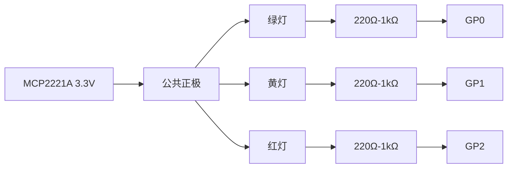

# Vibecoding Signal Light

**中文** | [English](README.en.md)

> 给 AI Agent 一个看得见的状态灯。

Vibecoding Signal Light 把一个红、黄、绿三色交通信号灯模型变成 AI 编程助手的实体状态面板。Codex、Claude Code 或其他本地 Agent 开始工作、请求权限、遇到阻塞时，桌上的信号灯会同步变化。

它的目标不是炫技，而是让 AI Agent 从屏幕里的文字流，变成房间里能被一眼感知的工作伙伴。

## 示例


参考实物安装在笔记本旁边，图中是绿灯常亮的空闲状态。

## 为什么做这个

AI 编程助手越来越能自己跑命令、改文件、开子任务，但它的状态通常还困在终端或聊天窗口里。于是你要么反复切回去看，打断自己的注意力；要么忘了它正在等权限、等你读结果、或者已经失败。

这个项目给 Agent 一个真实存在的环境信号：

- 绿灯：没事，继续你的事。
- 绿灯闪烁：Agent 正在工作。
- 黄闪：Agent 明确需要你看一眼或继续。
- 红闪：需要马上处理，通常是权限、阻塞或失败。

## 硬件

当前参考硬件：

| 硬件 | 说明 |
| --- | --- |
| MCP2221A USB GPIO 转接板 | 通过 USB 从电脑控制 GPIO |
| 三色交通信号灯模型 | 红、黄、绿三路 LED 或灯模块 |
| Python + EasyMCP2221 | 本地控制 GPIO，不需要额外云服务 |

默认接线是低电平点亮：

| 灯 | MCP2221A 引脚 | 含义 |
| --- | --- | --- |
| 绿灯 | `gp0` | 空闲 |
| 黄灯 | `gp1` | 需要关注 |
| 红灯 | `gp2` | 权限、阻塞或失败 |
| 有效电平 | GPIO `LOW` | 灯亮 |

### 接线

参考实物使用公共正极、低电平点亮的 LED 接法。每一路灯都应该串联独立限流电阻，除非你的交通灯模块已经内置电阻。

```text
MCP2221A 3.3V  ────────────────┬── 绿灯正极
                               ├── 黄灯正极
                               └── 红灯正极

绿灯负极   ── 220Ω-1kΩ ── GP0
黄灯负极  ── 220Ω-1kΩ ── GP1
红灯负极     ── 220Ω-1kΩ ── GP2
```



这种模式下 MCP2221A GPIO 负责下拉电流：

- GPIO `HIGH`：灯灭
- GPIO `LOW`：灯亮

如果你的灯是公共负极或高电平点亮，则应让每个 GPIO 通过限流电阻接到对应 LED 正极，LED 负极接 `GND`，并设置：

```bash
export SIGNAL_LIGHT_ACTIVE_LOW=0
```

注意：MCP2221A GPIO 只适合直接驱动小电流 LED。若你的信号灯是 5V/12V 灯组、灯带、继电器，或电流超过 GPIO 能力，请在 MCP2221A 和灯之间增加三极管、MOSFET、继电器模块或专用 LED 驱动。

你可以覆盖默认接线：

```bash
export SIGNAL_LIGHT_GREEN_PIN=gp0
export SIGNAL_LIGHT_YELLOW_PIN=gp1
export SIGNAL_LIGHT_RED_PIN=gp2
export SIGNAL_LIGHT_ACTIVE_LOW=1
```

如果你的灯是高电平点亮，设置 `SIGNAL_LIGHT_ACTIVE_LOW=0`。

## 灯语

灯语刻意保持简单，并且状态会持续显示。你不需要记复杂动画，只要看当前灯效。

| 灯效 | Agent 状态 | 你该做什么 |
| --- | --- | --- |
| 绿灯常亮 | 空闲 | 不用管 |
| 绿灯闪烁 | 正在思考、跑工具、改文件或测试 | 等它跑 |
| 黄灯闪烁 | 明确需要你读结果或继续 | 有空看一眼 |
| 红灯闪烁 | 需要权限、阻塞或失败 | 马上处理 |
| 全灭 | 手动清除 | 不用管 |

当前 MCP2221A GPIO 参考实现不会用软件 PWM 模拟呼吸灯，因为 USB GPIO 的时序抖动会造成肉眼可见的频闪。工作态默认是简单的绿灯闪烁。如果未来换成真正支持亮度控制的驱动，同一套模式可以渲染成柔和脉冲。

## 功能亮点

- 给 AI Agent 一个实体环境状态灯。
- macOS 華单栏应用，彩色图标 + 浮动详情面板。
- 支持 Codex hook。
- 支持 Claude Code hook。
- 支持多个 Agent 会话并发时的状态聚合。
- 红灯/黄灯告警不会被另一个会话的工作态覆盖。
- 后台 worker 保持灯效持续运行，hook 本身快速返回。
- 支持无硬件 dry-run 预览。
- 支持通过环境变量调整 GPIO 接线。

## 快速开始

安装依赖（使用 `uv`）：

```bash
uv sync                              # 仅核心
uv sync --extra gui                  # 含 macOS 華单栏
uv sync --extra hardware             # 含 MCP2221A GPIO
uv sync --extra all                  # 全部
```

查看灯语列表：

```bash
./scripts/signal-light list
```

无硬件预览：

```bash
./scripts/signal-light play working --dry-run
./scripts/signal-light play attention --dry-run
./scripts/signal-light play permission --dry-run
```

在真实 MCP2221A 上测试接线：

```bash
./scripts/signal-light test
```

播放真实信号：

```bash
./scripts/signal-light play working
./scripts/signal-light play permission
./scripts/signal-light play idle
```

Wrapper 脚本默认使用 `.venv/bin/python`（如果存在），否则回退到 `python3`。如果想通过 `uv` 运行：

```bash
export SIGNAL_LIGHT_USE_UV=1
```

### macOS 華单栏应用

启动软件信号灯（華单栏图标）：

```bash
uv run python -m signal_light gui start     # 启动華单栏守护进程
uv run python -m signal_light gui stop      # 停止（下次登录自动启动）
uv run python -m signal_light gui status    # 查看当前状态
uv run python -m signal_light gui install   # 安装开机自启
uv run python -m signal_light gui uninstall # 移除开机自启
```

## Codex 集成

安装或修复本地 hook 最简单的方式是内置向导：

```bash
./scripts/install-hooks
./scripts/install-hooks --all -y
./scripts/install-hooks --agent codex --agent claude-code -y
```

向导会识别已支持的 Agent，检查当前 hook 文件，写入前创建带时间戳的备份，并且只安装 Signal Light 自己的 hook 条目，保留同一事件下已有的其它 hook。

Codex hook 可以直接把事件名传给 wrapper：

```bash
./scripts/codex-signal-hook UserPromptSubmit
./scripts/codex-signal-hook PreToolUse
./scripts/codex-signal-hook PermissionRequest
./scripts/codex-signal-hook Stop
```

推荐映射：

| Codex 事件 | 灯效行为 |
| --- | --- |
| `SessionStart` | 绿灯空闲 |
| `UserPromptSubmit` | 绿灯闪烁（工作中） |
| `PreToolUse` | 绿灯闪烁（工作中） |
| `PostToolUse` | 绿灯闪烁（工作中） |
| `PermissionRequest` | 红灯闪烁 |
| `Stop` | 清理普通工作态 |
| `SessionEnd` | 绿灯短闪提示完成，然后恢复当前聚合状态 |

完整 `~/.codex/hooks.json` 示例见 [docs/LAMP_LANGUAGE.md](docs/LAMP_LANGUAGE.md)。

## Claude Code 集成

Claude Code 会通过 stdin 传入 JSON hook 数据，因此 wrapper 通常不需要额外参数：

```bash
echo '{"event":"PreToolUse","session_id":"demo"}' | ./scripts/claude-code-signal-hook
echo '{"event":"PermissionRequest","session_id":"demo"}' | ./scripts/claude-code-signal-hook
echo '{"event":"Notification","session_id":"demo"}' | ./scripts/claude-code-signal-hook
```

支持的 Claude Code 事件包括：

| Claude Code 事件 | 灯效行为 |
| --- | --- |
| `SessionStart` | 绿灯空闲 |
| `UserPromptSubmit` | 绿灯闪烁（工作中） |
| `PreToolUse` | 绿灯闪烁（工作中） |
| `PostToolUse` | 绿灯闪烁（工作中） |
| `PostToolUseFailure` | 红灯闪烁 |
| `Notification` | 黄灯闪烁 |
| `PermissionRequest` | 红灯闪烁 |
| `Stop` | 清理普通工作态 |
| `SessionEnd` | 绿灯短闪提示完成，然后恢复当前聚合状态 |

完整 `~/.claude/settings.json` 示例见 [docs/LAMP_LANGUAGE.md](docs/LAMP_LANGUAGE.md)。

## 多会话行为

运行时会记录每个 Agent 会话的最新状态，并把最高优先级状态显示到真实信号灯上：

```text
红灯闪烁 > 黄灯闪烁 > 工作循环 > 绿灯常亮
```

因此，一个会话正在等待权限时，即使另一个会话开始工作，红灯也不会被覆盖。普通 `Stop` 只会清掉非紧急的工作态，不会误清除已有红灯告警。

当某个已记录的会话结束、但其它会话还在运行时，运行时会让绿灯短暂闪烁，提示"有一个会话完成了"，然后恢复当前聚合状态。如果所有会话都结束了，最终会回到绿灯常亮。红灯或黄灯告警不会被这个完成提示打断。

## 项目状态

这是一个小而可改的 AI 编程硬件伴侣项目。你可以很容易地 fork 并扩展它：

- 把 MCP2221A 换成其他 GPIO 后端。
- 增加真正的 PWM 或灯带驱动。
- 把更多 Agent 系统映射到同一套灯语。
- 做一个更漂亮的外壳，把它放到桌面上。

如果 AI Agent 已经成了你的工作流的一部分，给它一盏真正的状态灯。
